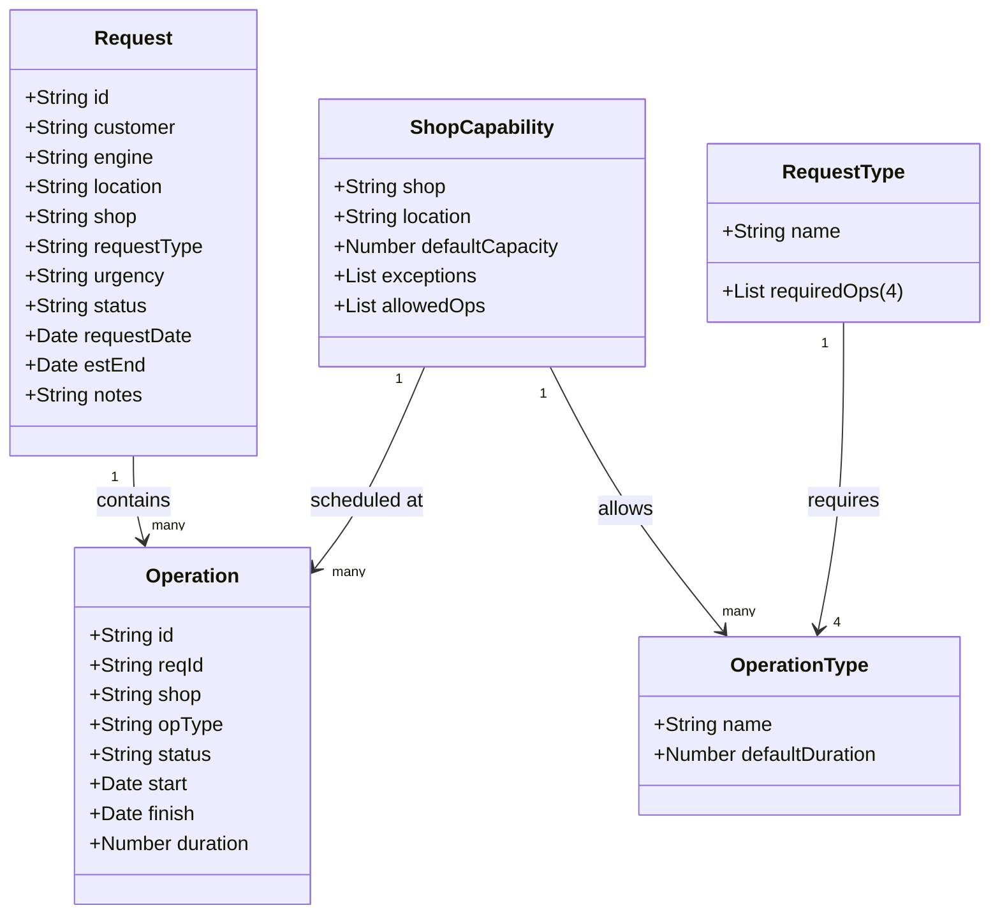

# 🚀 Protocop GO-LIVE : prompt GPT pour créer un prototype HTML

**🎯 But du doc :** cadrer un **prototype HTML autonome** (offline, sans dépendance)

**📌 Objectifs d'un prototype HTML :**

- 💡 Proposer et valider une vision produit
- 🗂️ Aider à structurer une feuille de route et à prioriser les fonctionnalités à haute valeur ajoutée
- 🖥️ Discuter et valider des idées d'interface ou un modèle de données
- 📑 Illustrer et préciser une spécification avec les développeurs comme les usagers

**🛠 Usages concrets :**

- 🖼️ Copie d’écran ou capture vidéo 
- 📊 Illustration avec des données réalistes 
- 👥 Tests utilisateurs (UI/UX)

**📥 Dépôt :**
- readme.md : questionnaire (et ex synthétique MAESTRO) à mettre dans GPT pour créer son prompt
- prompt.md : exemple de prompt complet MAESTRO à mettre dans GPT pour générer le prototype
- prototype.html : exemple de prototype MAESTRO à télécharger et à ouvrir dans un navigateur

**🤖 Astuces**

- 🔍 Prototyper petit d’abord
- ✏️ Demander à GPT de te poser des questions pour préciser ton prompt
- 🆘 Demander à GPT de te proposer des pistes d'améliorations
- 🔄 Mettre le plus de demandes possibles dans ton prompt avant régénération
- 📥 Demander à GPT de re-décrire ton prompt à partir du code ou de tes demandes additionnelles
- 📋 Plus ton prompt est précis, plus ton prototype sera fidèle mais plus la génération prend du temps
  
---

## 1️⃣ Identité

❓ *Quel nom afficher dans le bandeau en haut ?*  
❓ *Quel style général ?*  
❓ *En une phrase, à quoi sert cet outil ?*

**Exemple : MAESTRO**

- **Nom affiché :** MAESTRO
- **Style :** Thème clair SAP‑like
- **Objectif :** Créer/éditer des demandes et opérations de maintenance sur les moteurs d'avion, piloter les capacités et afficher des KPIs, le tout offline dans un fichier HTML unique sans dépendances externes.

---

## 2️⃣ Modèle de données

❓ *Quels sont les objets métiers de l'application ? (ex. Demande, Opération, Ressource, Calendrier…)*  
❓ *Pour chaque objet : propriétés, validations, permissions ?*  
❓ *Relations entre objets : cardinalités, contraintes (suppression en cascade, restrictions, compatibilités, relations obligatoires, limites quantitatives, contraintes temporelles, unicité, synchronisation d’état)*  
❓ *Quelles données en exemple ?*

**Exemple : MAESTRO**

- **Objets principaux :** Demande, Opération, Listes maîtres, Mapping, Durées, Capacités atelier
- **Relations :** Demande 1..N Opération, Shop 1..N Operation Types, Request Type 1..4 Operation Types
- **Données d’exemple :** Urgency (4), Status (4), 10 shops, 5 locations, 12 ops types, 5 modèles moteur, 5 clients, 3 request types (4 ops chacune), durées 1–5 semaines, 10 demandes, 30 opérations

---

## 3️⃣ Navigation et écrans

❓ *Quels onglets/écrans veux-tu ?*  
❓ *Pour chaque onglet : données, actions, aides ?*  
❓ *Comment naviguer entre les onglets ?*  
❓ *Comportement entre écrans ?*

**Exemple : MAESTRO**

- **Nouvelle demande** : création avec helper panel (4 ops requises, capacity lookup)
- **Éditer opérations** : ajout/édition avec helper (opérations autorisées par shop)
- **Demandes** : tableau filtrable, IDs cliquables vers opérations
- **Opérations** : tableau filtrable, IDs cliquables vers demandes
- **Listes maîtres** : édition des listes, mapping, durées, JSON Viewer, Apply changes
- **KPI** : On-time % urgent + heatmap

---

## 4️⃣ Techniques

❓ *Quelles fonctionnalités avancées ?*  
❓ *Quelles contraintes techniques ?*

**Exemple : MAESTRO**

- HTML unique, offline, Vanilla JS, dropdowns dynamiques, import/export JSON, recherche, entêtes sticky, thème clair SAP-like

## Detailed Functionality Overview

### Architecture
- **Single‑file, offline prototype** — `prototype.html` bundles HTML, CSS, and Vanilla JS to run entirely in the browser with no external dependencies.
- **Central state object (`S`)** — Keeps master data lists (`mdLists`), mappings from request types to required operations, default operation durations, shop capabilities, and runtime data for requests & operations.

### Data Model & Seeding
- **Master data (seedMasterData)**  
  - Preloads lists for Urgency, Status, Shop, Location, Operation Type, Engine Model, Customer, and Request Type.  
  - Builds `requestTypeToOps` mapping (each request type → four mandatory operation types).  
  - Stores default durations (`opDur`) and per-shop capabilities (allowed operations, default capacity, location, capacity exceptions).

- **Transactional data (seedTransactions)**  
  - Generates 10 sample requests with calculated estimated end dates based on required operations.  
  - Creates 30 sample operations linked to requests, respecting shop capabilities and random scheduling.

### UI Screens
1. **New Request Form**  
   - Auto‑assigns request IDs.  
   - Dynamic dropdowns from master data.  
   - Calculates estimated end date from required operations.  
   - Helper pane showing required operations and a “capacity lookup” to check availability by date, shop, and operation type.

2. **Edit Operations Form**  
   - Auto‑assigns operation IDs.  
   - Filters operation types by chosen shop.  
   - Auto-computes finish date from start date and duration.  
   - Helper pane listing allowed operations per shop and default capacity.

3. **Requests Table**  
   - Searchable by Request ID.  
   - Displays linked operations count; clicking IDs navigates to filtered views.

4. **Operations Table**  
   - Searchable by Operation or Request ID.  
   - Clicking IDs navigates to related request table or pre-filled edit form.

5. **Master Data Editor**  
   - Text columns for each master list.  
   - Editable mapping: Request Type ↔ four Operation Types (enforces uniqueness).  
   - Editable default durations per operation type.  
   - “Apply MD Changes” recalculates dependent data and refreshes UI.  
   - Read-only JSON viewer with copy/download.

6. **KPI Dashboard**  
   - Calculates on-time percentage for urgent requests.  
   - Weekly capacity heatmap (Location × Shop) for the next 8 weeks with color-coded utilization.

### Utility & Persistence Features
- Auto-generated IDs (`nextRequestId`, `nextOpId`).
- Date formatting and ISO-week calculations for capacity logic.
- JSON import/export of the entire state.
- Event bindings handle form actions, table filtering, and master data updates.

## UML Class Diagram (Mermaid)

## Repository Functionalities

- **Project scope** – This repo guides users in building self-contained HTML prototypes with GPT. It provides a questionnaire, an example prompt, and a working prototype file to validate product ideas offline without external dependencies.
- **MAESTRO prototype** – The included prompt and HTML illustrate a maintenance tool for aircraft engines. It defines domain objects (Requests, Operations, master lists, mappings), data relations, and seeded example records to simulate real scenarios.
- **User interface & navigation** – The prototype presents multiple screens (New Request form, Operation editor, Requests/Operations tables, Master Data editor, KPI dashboard) accessible via a tab bar. Tables support filtering and cross-navigation through ID links.
- **Interactive features** – JavaScript functions enable dynamic dropdowns, capacity lookups, auto-calculated dates, and event bindings for creating, editing, and linking maintenance records.
- **Data persistence utilities** – Users can export and import the entire dataset as JSON directly from the interface, supporting offline usage and easy data sharing.
