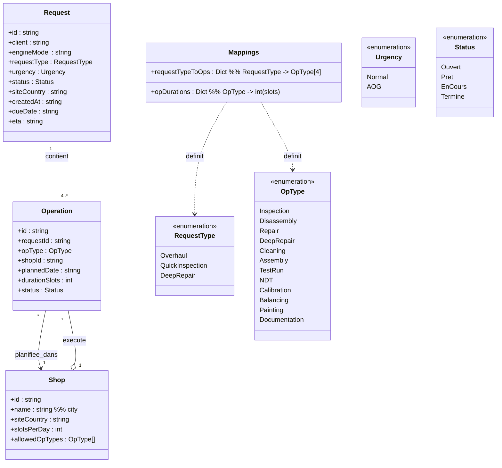

# Introduction

**📌 Objectifs d'une interface de démo :**

- 💡 Proposer et valider un parcours utilisateur
- 🗂️ Valider et prioriser des besoins

**🛠 Usages concrets :**

- 🎨 Brainstorming / Co-construction
- ✍️ Spécifications / Critères d'acceptance
- 👥 Tests utilisateurs (UI/UX)
- 🖼️ Démos réalistes (UI/UX)

**💡 Démarche IA**

1. 🚲 Minimalisme → privilégier peu de logique métier, données statiques  
2. 🧩 Simplification → prototyper petit avec hypothèses légères  
3. 🎤 Clarification → demander à GPT de poser des questions  
4. 💡 Amélioration → demander à GPT des pistes d’optimisation  
5. 📦 Exhaustivité → regrouper un max de demandes dans un message avant régénération  
6. 📐 Vérification → générer un diagramme UML pour documenter  
7. 📝 Itération → amender le prompt jusqu’à satisfaction  
8. 📌 Transmission → demander à GPT de refournir le prompt final

**🤖 Lien à la conversation IA**
```
https://chatgpt.com/share/68a0d807-4840-8006-9d30-151a537dea22
```

# Prompt

## 1) 🎯 CONTEXTE
❓ À quoi sert ce prototype ?
❓ Qui l’utilise et dans quel but immédiat ?
❓ Quels critères de succès pour la démo ?

- Objectif : suivre l’**occupation des shops** (ateliers) et le **respect des délais** (dont urgences AOG) sur **8 semaines**.
- Utilisateurs : **planificateurs Safran** (suivi, micro-replanification, vérification capacité).
- Succès POC : **heatmap** exploitable (shops × jours), **recherche par ID**, navigation par **liens cliquables**, **édition inline** avec **persistance locale**, **import/export JSON**.


## 2) 🗂️ MODÈLE DE DONNÉES
❓ Quels objets métier minimum ?
❓ Quelles relations/règles clés ?
❓ Quels jeux de données de départ ?

**Structure de données**:

**Request (Demande)** : `id`, `client`, `engineModel`, `requestType` (3), `urgency` (Normal/AOG), `status` (Ouvert/Prêt/En cours/Terminé), `siteCountry`, `dueDate`, `eta`, `createdAt`.
**Operation** : `id`, `requestId`, `opType` (12), `shopId`, `plannedDate`, `durationSlots`, `status`.
**Shop** : `id`, `name` (ville), `siteCountry` (pays), `allowedOpTypes` (subset des 12), `slotsPerDay`.
**Mappings** :
  - `requestTypeToOps` (3 × 4) :  
    - Overhaul → Disassembly, Repair, Assembly, TestRun  
    - QuickInspection → Inspection, Cleaning, Assembly, TestRun  
    - DeepRepair → Disassembly, DeepRepair, Assembly, TestRun
  - `opDurations` (par `opType`, en *slots*).
**Règles** :
  - 1 Request ⇒ **4 Operations** selon `requestType`.
  - `shopId` doit **supporter** `opType`.
  - **Occupation shop-jour** (%) = `Σ slots planifiés / slotsPerDay`.
  - **% urgences à l’heure** = `#AOG Done à temps / #AOG Done`.

**Données réalistes** :
  - Clients (10) : Air France, Lufthansa, Ryanair, easyJet, Turkish Airlines, Qatar Airways, Emirates, American Airlines, Delta, United.
  - EngineModels (5) : CFM56, LEAP-1A, LEAP-1B, GE90, Trent 700.
  - Sites/Pays (5) : France, Allemagne, Espagne, Royaume-Uni, Italie.
  - Shops (10 = 2 par pays) : Toulouse, Lyon, Hambourg, Francfort, Madrid, Barcelone, Londres, Manchester, Milan, Turin.  
    - Chaque shop : `slotsPerDay` (6–9), `allowedOpTypes` (2–4 familles).
  - OpTypes (12) : Inspection, Disassembly, Repair, DeepRepair, Cleaning, Assembly, TestRun, NDT, Calibration, Balancing, Painting, Documentation.
  - Volumétrie POC : **10 demandes**, **50 opérations**, étalées sur **J+0 → J+55**.



## 3) 🖥️ INTERFACE (Fiori-like)
❓ Quels écrans et parcours essentiels ?
❓ Quelles interactions minimum ?
❓ Comment présenter KPI et données pour agir vite ?

- **Barre de recherche (ID)** : tape Request# ou Operation# → résultat **cliquable** → ouvre la fiche.
- **Filtres rapides** : période (fixe 8 semaines), **Site (pays)**, **Shop (ville)**, **Type de demande (3)**, **Urgence (2)**, **Statut**, **Type d’opération (12)**.
- **Bandeau KPI (cartes)** :
  - **Utilisation globale (8 sem)** (%)
  - **% urgences livrées à l’heure**
  - **Backlog/Retards** (opés non planifiées / dépassées)
  - **ETA moyen** des demandes actives
- **Heatmap Shops × Jours (8 semaines)** :
  - Lignes : 10 shops | Colonnes : J+0 → J+55
  - Cellule = `% d’occupation` (✅ 0–85% • ⚠️ 85–100% • 🟥 >100%)
  - Tooltip : date, shop, capacité, charge (slots), nb opés, %
  - **Clic cellule** ⇒ ouvre l’onglet *Operations* **préfiltré** (shop + jour)
- **Listes** :
  - *Requests* : lignes compactes avec **Request# cliquable**, badges (type, urgence, statut), due/eta.
  - *Operations* : **Operation# cliquable**, shop, date, type, statut, durée (slots).
- **Fiches** :
  - **Demande** : propriétés éditables + liste de ses **4 opérations** (liens).
  - **Opération** : **shop** (sélecteur filtré par compatibilité), **date**, **durée**, **statut** (éditables).
- **Parcours démo (90s)** :
  1) Filtre **France → Lyon** → heatmap montre 🟥 S+2 (mercredi).  
  2) Clic cellule 🟥 → *Operations* filtré → éditer l’opé (shop/date) → **auto-save**.  
  3) KPI **Utilisation** & **% urgences à l’heure** s’améliorent.  
  4) **Exporter JSON** → **Reset** → **Importer JSON** pour restaurer.

## 4) 🧱 TECHNIQUE
❓ Comment structurer simplement (standalone) ?
❓ Quelles features techniques livrer dès le POC ?
❓ Comment persister et échanger les données ?

- **Mono-fichier** : `prototype.html` (HTML/CSS/**Vanilla JS**, zéro dépendance).
- **State central `S`** : `mdLists`, `mappings`, `shops`, `requests`, `operations`, `ui`.
- **Rendu** : fonctions `render*()` (KPI, Heatmap, Tables, Fiches, Search).
- **Édition & Persistance** : mise à jour **in-UI** + **localStorage** (`MAESTRO_STATE_V1`), bouton **Reset data**.
- **Import/Export JSON** :  
  - Export : télécharge `maestro-data.json` (contenu de `S`).  
  - Import : upload → remplace l’état + re-render.  
- **Validations** : compatibilité shop/opType, alerte >100% occupation (confirmable), régénération des 4 opés si `requestType` change (avec confirmation).
- **Perf cible** : fluide jusqu’à **~500 opérations** ; DOM simple (sans lib).
- **Accessibilité** : focus visible, contrastes, tooltips ARIA.

### 📦 Livrables (8)
1) `prototype.html` **standalone** (HTML/CSS/JS).  
2) **Seed réaliste** : 10 demandes, 50 opérations, 10 shops, mappings 3×4, 12 opTypes, 5 pays.  
3) **Heatmap interactive** 8 semaines (shops × jours).  
4) **Bandeau KPI** (utilisation, % urgences à l’heure, backlog, ETA).  
5) **Recherche par ID** + navigation via liens cliquables.  
6) **Fiches éditables** (demande/opération) avec validations.  
7) **Auto-save** session + **Reset**.  
8) **Import/Export JSON**.
9) Interface à la **SAP-IBP Fiori**. Thème clair.
