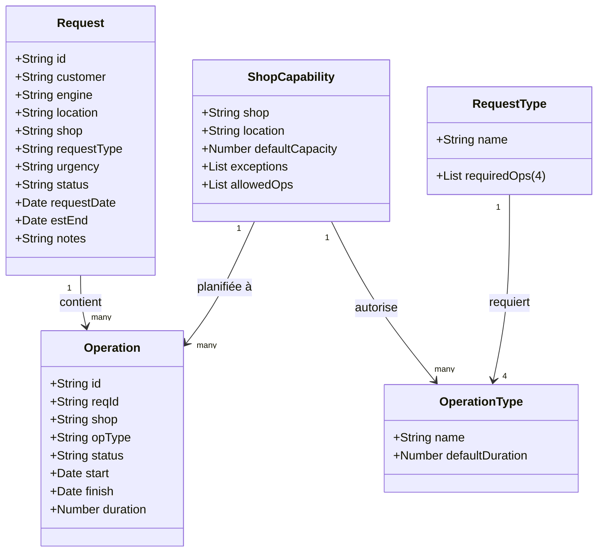

## Aperçu détaillé des fonctionnalités

### Architecture
- **Prototype autonome en un seul fichier** — `prototype.html` regroupe HTML, CSS et JavaScript Vanilla pour fonctionner entièrement dans le navigateur sans dépendance externe.
- **Objet d'état central (`S`)** — Contient les listes de données maîtres (`mdLists`), les correspondances entre types de demandes et opérations requises, les durées d'opérations par défaut, les capacités des ateliers et les données dynamiques pour les demandes et opérations.

### Modèle de données et remplissage initial
- **Données de référence (seedMasterData)**
  - Précharge les listes Urgence, Statut, Atelier, Lieu, Type d'opération, Modèle de moteur, Client et Type de demande.
  - Construit la correspondance `requestTypeToOps` (chaque type de demande → quatre types d'opérations obligatoires).
  - Stocke les durées par défaut (`opDur`) et les capacités par atelier (opérations autorisées, capacité par défaut, localisation, exceptions de capacité).

- **Données transactionnelles (seedTransactions)**
  - Génère 10 demandes d'exemple avec calcul des dates de fin estimées en fonction des opérations requises.
  - Crée 30 opérations d'exemple liées aux demandes, en respectant les capacités des ateliers et un planning aléatoire.

### Écrans de l'UI
1. **Formulaire Nouvelle Demande**
   - Attribue automatiquement les identifiants de demande.
   - Listes déroulantes dynamiques basées sur les données maîtres.
   - Calcule la date de fin estimée à partir des opérations requises.
   - Volet d'aide indiquant les opérations requises et une « recherche de capacité » pour vérifier la disponibilité par date, atelier et type d'opération.

2. **Formulaire d'édition d'opérations**
   - Attribue automatiquement les identifiants d'opération.
   - Filtre les types d'opération en fonction de l'atelier choisi.
   - Calcule automatiquement la date de fin à partir de la date de début et de la durée.
   - Volet d'aide listant les opérations autorisées par atelier et la capacité par défaut.

3. **Tableau des demandes**
   - Recherche par identifiant de demande.
   - Affiche le nombre d'opérations liées ; clic sur les identifiants pour naviguer vers des vues filtrées.

4. **Tableau des opérations**
   - Recherche par identifiant d'opération ou de demande.
   - Clic sur les identifiants pour naviguer vers le tableau des demandes ou le formulaire d'édition prérempli.

5. **Éditeur de données maîtres**
   - Colonnes de texte pour chaque liste maîtresse.
   - Mapping éditable : Type de demande ↔ quatre types d'opérations (unicité garantie).
   - Durées par défaut éditables pour chaque type d'opération.
   - « Appliquer les modifications MD » recalculant les données dépendantes et rafraîchissant l'interface.
   - Visualiseur JSON en lecture seule avec copie/téléchargement.

6. **Tableau de bord KPI**
   - Calcule le pourcentage de demandes urgentes livrées à temps.
   - Carte de chaleur de capacité hebdomadaire (Lieu × Atelier) pour les 8 semaines à venir avec code couleur selon l'utilisation.

### Fonctionnalités utilitaires et de persistance
- Identifiants générés automatiquement (`nextRequestId`, `nextOpId`).
- Formatage des dates et calcul des semaines ISO pour la logique de capacité.
- Import/export JSON de l'état complet.
- Les liaisons d'événements gèrent les actions de formulaire, le filtrage des tableaux et les mises à jour des données maîtres.

## Diagramme de classes UML (Mermaid)

## Fonctionnalités du dépôt

- **Périmètre du projet** – Ce dépôt guide les utilisateurs pour construire des prototypes HTML autonomes avec GPT. Il fournit un questionnaire, un exemple de prompt et un fichier prototype fonctionnel pour valider des idées produit hors ligne sans dépendances externes.
- **Prototype MAESTRO** – Le prompt et le HTML inclus illustrent un outil de maintenance pour moteurs d'avion. Il définit les objets métier (Demandes, Opérations, listes maîtres, mappings), les relations de données et des enregistrements d'exemple préremplis pour simuler des scénarios réels.
- **Interface utilisateur & navigation** – Le prototype présente plusieurs écrans (formulaire Nouvelle Demande, éditeur d'Opérations, tableaux Demandes/Opérations, éditeur de données maîtres, tableau de bord KPI) accessibles via une barre d'onglets. Les tableaux prennent en charge le filtrage et la navigation croisée via les liens d'ID.
- **Fonctionnalités interactives** – Les fonctions JavaScript activent les listes déroulantes dynamiques, les recherches de capacité, le calcul automatique des dates et les liaisons d'événements pour créer, éditer et lier des enregistrements de maintenance.
- **Utilitaires de persistance des données** – Les utilisateurs peuvent exporter et importer l'ensemble des données au format JSON directement depuis l'interface, ce qui permet une utilisation hors ligne et un partage facile des données.
