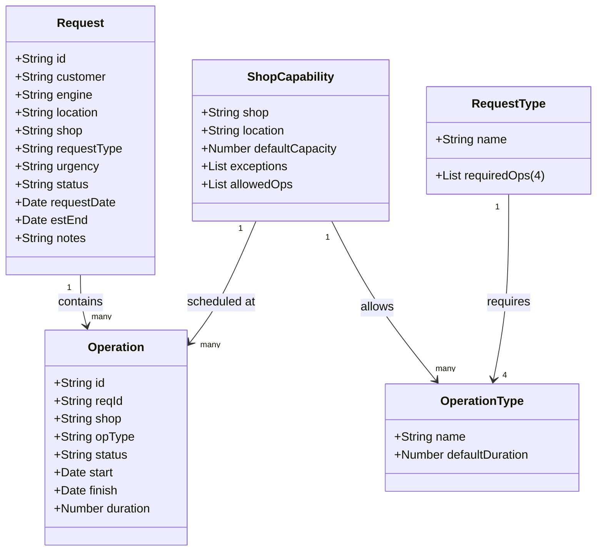

## Detailed Functionality Overview

### Architecture
- **Single‑file, offline prototype** — `prototype.html` bundles HTML, CSS, and Vanilla JS to run entirely in the browser with no external dependencies.
- **Central state object (`S`)** — Keeps master data lists (`mdLists`), mappings from request types to required operations, default operation durations, shop capabilities, and runtime data for requests & operations.

### Data Model & Seeding
- **Master data (seedMasterData)**  
  - Preloads lists for Urgency, Status, Shop, Location, Operation Type, Engine Model, Customer, and Request Type.  
  - Builds `requestTypeToOps` mapping (each request type → four mandatory operation types).  
  - Stores default durations (`opDur`) and per-shop capabilities (allowed operations, default capacity, location, capacity exceptions).

- **Transactional data (seedTransactions)**  
  - Generates 10 sample requests with calculated estimated end dates based on required operations.  
  - Creates 30 sample operations linked to requests, respecting shop capabilities and random scheduling.

### UI Screens
1. **New Request Form**  
   - Auto‑assigns request IDs.  
   - Dynamic dropdowns from master data.  
   - Calculates estimated end date from required operations.  
   - Helper pane showing required operations and a “capacity lookup” to check availability by date, shop, and operation type.

2. **Edit Operations Form**  
   - Auto‑assigns operation IDs.  
   - Filters operation types by chosen shop.  
   - Auto-computes finish date from start date and duration.  
   - Helper pane listing allowed operations per shop and default capacity.

3. **Requests Table**  
   - Searchable by Request ID.  
   - Displays linked operations count; clicking IDs navigates to filtered views.

4. **Operations Table**  
   - Searchable by Operation or Request ID.  
   - Clicking IDs navigates to related request table or pre-filled edit form.

5. **Master Data Editor**  
   - Text columns for each master list.  
   - Editable mapping: Request Type ↔ four Operation Types (enforces uniqueness).  
   - Editable default durations per operation type.  
   - “Apply MD Changes” recalculates dependent data and refreshes UI.  
   - Read-only JSON viewer with copy/download.

6. **KPI Dashboard**  
   - Calculates on-time percentage for urgent requests.  
   - Weekly capacity heatmap (Location × Shop) for the next 8 weeks with color-coded utilization.

### Utility & Persistence Features
- Auto-generated IDs (`nextRequestId`, `nextOpId`).
- Date formatting and ISO-week calculations for capacity logic.
- JSON import/export of the entire state.
- Event bindings handle form actions, table filtering, and master data updates.

## UML Class Diagram (Mermaid)

## Repository Functionalities

- **Project scope** – This repo guides users in building self-contained HTML prototypes with GPT. It provides a questionnaire, an example prompt, and a working prototype file to validate product ideas offline without external dependencies.
- **MAESTRO prototype** – The included prompt and HTML illustrate a maintenance tool for aircraft engines. It defines domain objects (Requests, Operations, master lists, mappings), data relations, and seeded example records to simulate real scenarios.
- **User interface & navigation** – The prototype presents multiple screens (New Request form, Operation editor, Requests/Operations tables, Master Data editor, KPI dashboard) accessible via a tab bar. Tables support filtering and cross-navigation through ID links.
- **Interactive features** – JavaScript functions enable dynamic dropdowns, capacity lookups, auto-calculated dates, and event bindings for creating, editing, and linking maintenance records.
- **Data persistence utilities** – Users can export and import the entire dataset as JSON directly from the interface, supporting offline usage and easy data sharing.
