# Contexte

**📌 Objectifs d'un prototype applicatif / HTML :**

- 💡 Proposer et valider une vision produit
- 🗂️ Aider à structurer une feuille de route et à prioriser les fonctionnalités à haute valeur ajoutée
- 🖥️ Discuter et valider des idées d'interface ou un modèle de données
- 📑 Illustrer et préciser une spécification avec les développeurs comme les usagers

**🛠 Usages concrets :**

- ✍️ Spécifications / Critères d'acceptance
- 👥 Tests utilisateurs (UI/UX)
- 🖼️ Démos réalistes (UI/UX)

**💡 Démarche IA**
0. 🏃‍♂️ Privilégier un format plus léger (donnée statique ou style épuré avec peu de JS...) avec le minimum données
1. 🔍 Prototyper petit avec des hypothèses de simplification
2. ✏️ Demander à GPT de te poser des questions pour préciser ton prompt
3. 🆘 Demander à GPT de te proposer des pistes d'amélioration ou de simplification
4. 🔄 Mettre le plus de demandes possibles dans ton prompt avant régénération
5. 📥 Amender le prompt jusqu'à ce qu'il te convient avec de générer le prototype
6. 📋 Quand tu es satisfait, demande à GPT de te refournir le prompt pour reprendre ailleurs

  
# Prompt

## 1️⃣ Contexte

❓ *Quel nom afficher dans le bandeau en haut ?*  
❓ *Quel style général ?*  
❓ *En une phrase, à quoi sert cet outil ?*
❓ *Quelles sont les hypothèses de simplification ?*

**Nom de l’application** : **MAESTRO**  
**Style visuel** : interface claire et moderne, inspirée de SAP IBP :  
- Organisation en **cartes et onglets**  
- En-têtes toujours visibles  
- **Couleurs codées** pour représenter les capacités (vert, jaune, rouge)  
- Boutons arrondis pour un rendu plus agréable  

**Objectif** :  
MAESTRO est une application locale, qui fonctionne entièrement dans un fichier HTML sans connexion Internet.  
Elle permet de :  
- **Créer et modifier** des demandes de maintenance moteur  
- **Suivre** les opérations associées  
- **Vérifier** les capacités des ateliers (shops)  
- **Visualiser** des indicateurs clés de performance (KPI)  

**Hypothèses** :  
- 🎯 Demande = 1 moteur, plusieurs types supportés
- 🧩 Pack fixe de 4 opérations par type (aucune variante ni sous-op)
- ⏱️ Durées fixes par opération; ETA = somme des durées (sans attente capacité)
- 🏭 Capacité par atelier en “créneaux/jour” (pas d’heures, pas d’équipes)
- ✅ Compatibilité stricte atelier ↔ opération (pas d’exception)
- 🔁 Séquencement simple des 4 opérations (pas de parallélisation, pas de buffers)
- 🚦 Statuts simplifiés: Demande (Planned/Delivered), Opération (Planned/In Progress/Done)
- 🧱 Règles de contrôle: shop incompatible, opération non requise, capacité pleine, ensemble exact des 4
- ♻️ Suppression d’une opération = créneau capacité ré-ouvert immédiatement (pas de replanif auto)
- 📊 KPI unique: On-Time % sur AOG (livré ≤ ETA)
- 🔎 Navigation croisée simple Demandes ↔ Opérations (pas de recherche avancée)
- 🔐 Rôle unique “Planner”; données locales en mémoire; référentiels statiques

## 2️⃣ Modèle

❓ *Quels sont les objets métiers de l'application ? (ex. Demande, Opération, Ressource, Calendrier…)*  
❓ *Pour chaque objet : propriétés, validations, permissions ?*  
❓ *Relations entre objets : cardinalités, contraintes (suppression en cascade, restrictions, compatibilités, relations obligatoires, limites quantitatives, contraintes temporelles, unicité, synchronisation d’état)*  
❓ *Quelles données en exemple ?*
❓ *Quelle est la structure de données UML ?*

**Demande (Request)**  
C’est la fiche de départ : un client demande la maintenance d’un moteur.  
- Contenu : numéro unique, client, type de moteur, localisation, atelier choisi, type de demande, niveau d’urgence, statut, date de création, date de fin estimée, notes éventuelles  
- Règles : certains champs sont obligatoires (client, moteur, atelier, etc.). La date de fin est calculée automatiquement.  
- Particularité : chaque type de demande nécessite exactement 4 opérations obligatoires.  

**Opération (Operation)**  
Une demande est toujours composée de plusieurs opérations.  
- Contenu : numéro unique, lien avec une demande, atelier concerné, type d’opération, statut, date de début, durée prévue (1 à 5 semaines), date de fin  
- Règles : certains champs obligatoires. La date de fin se calcule seule.  
- Particularité : une opération doit être autorisée dans l’atelier choisi.  

**Listes maîtres (référentiels)**  
Elles contiennent toutes les valeurs disponibles dans les menus déroulants : urgences, statuts, ateliers, localisations, types d’opérations, modèles moteurs, clients, types de demandes.  

**Mappings & règles**  
- Chaque type de demande doit correspondre à 4 opérations distinctes  
- Chaque type d’opération a une durée par défaut (1 à 5 semaines)  
- Chaque atelier (shop) a une capacité par défaut, une localisation et peut avoir des exceptions  

**Relations entre données**  
- Une demande → plusieurs opérations  
- Un atelier → plusieurs types d’opérations autorisés  
- Un type de demande → exactement 4 opérations  

**Données d’exemple**  
À l’ouverture, l’application se remplit avec des données fictives :  
- 4 urgences, 4 statuts  
- 10 ateliers, 5 localisations  
- 12 types d’opérations  
- 5 modèles de moteur, 5 clients  
- 3 types de demandes (chacun avec 4 opérations)  
- 10 demandes et 30 opérations générées au hasard

**Synthèse UML**

```mermaid
classDiagram
    class Request {
        +String id
        +String customer
        +String engine
        +String location
        +String shop
        +String requestType
        +String urgency
        +String status
        +Date requestDate
        +Date estEnd
        +String notes
    }

    class Operation {
        +String id
        +String reqId
        +String shop
        +String opType
        +String status
        +Date start
        +Date finish
        +Number duration
    }

    class ShopCapability {
        +String shop
        +String location
        +Number defaultCapacity
        +List<Exception> exceptions
        +List<String> allowedOps
    }

    class RequestType {
        +String name
        +List<String> requiredOps (4)
    }

    class OperationType {
        +String name
        +Number defaultDuration
    }

    Request "1" --> "many" Operation : contient
    ShopCapability "1" --> "many" Operation : planifiée à
    RequestType "1" --> "4" OperationType : requiert
    ShopCapability "1" --> "many" OperationType : autorise
```

## 3️⃣ Interface

❓ *Quels onglets/écrans veux-tu ?*  
❓ *Pour chaque onglet : données, actions, aides ?*  
❓ *Comment naviguer entre les onglets ?*  
❓ *Comportement entre écrans ?*

**Nouvelle demande**  
- Formulaire simple pour saisir une demande (champs obligatoires en jaune)  
- Panneau d’aide : montre automatiquement les 4 opérations requises par type de demande + vérification de capacité d’un atelier à une date donnée  
- Actions : créer une demande, recalculer la date de fin  

**Éditer opérations**  
- Formulaire pour créer ou modifier une opération liée à une demande  
- Panneau d’aide : indique quelles opérations sont autorisées dans l’atelier choisi  
- Actions : sauvegarder ou supprimer l’opération  

**Demandes**  
- Tableau de toutes les demandes  
- Chaque numéro de demande est cliquable → ouvre les opérations liées  

**Opérations**  
- Tableau de toutes les opérations  
- Numéro d’opération cliquable → ouvre l’édition de cette opération  
- Numéro de demande cliquable → ouvre la fiche demande correspondante  

**Listes maîtres**  
- Tableaux éditables pour ajouter/modifier les valeurs de référence  
- Mapping obligatoire : chaque type de demande doit être lié à 4 opérations distinctes  
- Table de durée par type d’opération  
- Actions : appliquer les changements, voir les données au format JSON (export/copie possible)  

**Tableau de bord (KPI)**  
- Pourcentage de demandes urgentes livrées dans les temps  
- Carte de chaleur (heatmap) des capacités hebdomadaires (par localisation et atelier, sur 8 semaines)  

**Navigation**  
- Onglets visibles en permanence en haut de l’écran  
- Clic sur un ID → ouvre automatiquement l’écran concerné avec un filtre appliqué  

## 4️⃣ Technique

❓ *Quelles fonctionnalités avancées ?*  
❓ *Quelles contraintes techniques ?*

**Fonctionnalités intégrées**  
- Tout tient dans un seul fichier HTML (aucune installation, aucun serveur)  
- Données d’exemple créées automatiquement au démarrage  
- Menus déroulants dynamiques (les opérations proposées dépendent de l’atelier choisi)  
- Calculs automatiques : dates de fin, capacité disponible, KPI  
- Tableaux filtrables et recherche instantanée  
- Import / export de toutes les données en JSON  
- Visionneuse JSON pratique : repliable, copiable, téléchargeable  
- Tableaux avec en-têtes fixes et survol des lignes  
- Tableau de bord mis à jour en temps réel  
- Affichage adapté mobile (les sections se mettent en pile)  

**Limitations techniques**  
- Pas de sauvegarde automatique (il faut exporter/importer les données pour garder l’historique)  
- Pas de connexion serveur (tout se fait dans ton navigateur)  
- Les capacités sont toujours calculées par semaine entière (norme ISO)  
- Si les règles de mapping ou de durée ne sont pas respectées, un avertissement s’affiche 
