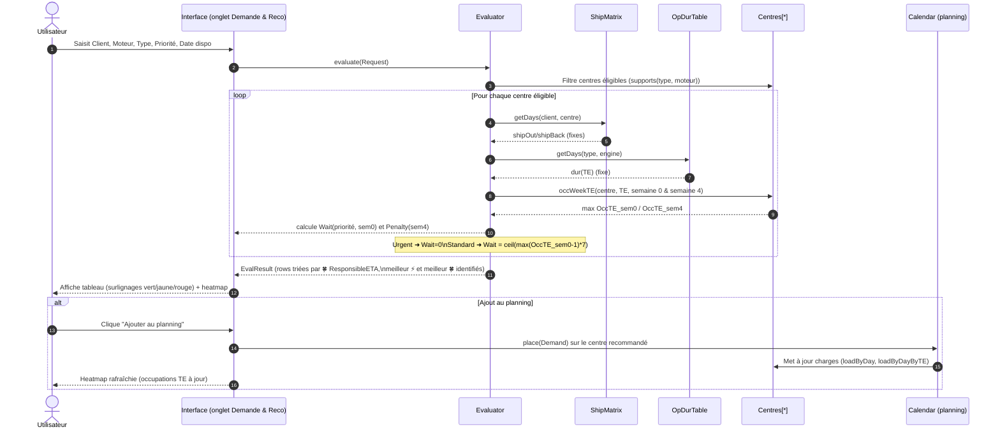

# Introduction

**📌 Objectifs d'un prototype fonctionnelle HTML :**

- 💡 Transformer une idée en une feature
- 🗂️ Stabiliser les besoins autour de la feature en vue du développement

**🛠 Usages concrets :**

- 🎨 Brainstorming / Co-construction
- ✍️ Spécifications / Critères d'acceptance
- 👥 Tests utilisateurs (UI/UX)
- 🖼️ Démos réalistes (UI/UX)

**💡 Démarche IA**

1. 🚲 Minimalisme → privilégier peu de logique métier, données statiques  
2. 🧩 Simplification → prototyper petit avec hypothèses légères  
3. 🎤 Clarification → demander à GPT de poser des questions  
4. 💡 Amélioration → demander à GPT des pistes d’optimisation  
5. 📦 Exhaustivité → regrouper un max de demandes dans un message avant régénération  
6. 📐 Vérification → générer un diagramme UML pour documenter  
7. 📝 Itération → amender le prompt jusqu’à satisfaction  
8. 📌 Transmission → demander à GPT de refournir le prompt final

**🤖 Lien à la conversation IA**
```
https://chatgpt.com/share/68a33867-818c-8006-ac8c-efbd47c3d3ec
```
> [!NOTE] 
> L'exemple montré n'est pas à suivre. Il comporte des itérations de code existant qui échouent. Cela montre bien l'importance de regrouper les demandes dans un un message pour générer le nouveau code. Pour résoudre le problème, il est nécessaire de demander la régénération complet du prototype même pour des amélioration mineurs. 

# Prompt


## 1. Contexte  
**❓Quel problème on résout ? Pour qui ? Avec quels compromis ?**  
- But : recommander le **centre de maintenance** le plus adapté pour une demande (Client, Moteur, Type, Priorité), avec 2 stratégies : **⚡ FastETA** (le plus court) et **🍀 ResponsibleETA** (le plus sûr vs saturation).  
- Utilisateurs : planificateurs / coordinateurs MRO qui veulent **voir, simuler, affecter** vite.  
- Compromis (prototype) : **réaliste mais léger** → acheminement **fixe** (client×centre), durée **fixe** (type×moteur), **pas** de géodistance, **pas** d’aléas.  
- Déterminisme : à paramètres identiques (y c. **date de dispo**), l’ETA **ne varie pas**.

---

## 2. Données  
**❓De quelles données ai-je besoin ? Qu’est-ce qui est fixe vs aléatoire ? Comment initialiser vite ?**  
- **TE = Type × Engine (couple “type de demande × moteur”)**. C’est l’unité de charge/capacité pour mesurer la saturation fine.  
- **Référentiels**  
  - **Centres** (20 villes FR). Chaque centre gère **2–3 moteurs** parmi `LEAP-1A, LEAP-1B, CFM56-5B, CFM56-7B, SaM146` et **2–3 types** parmi `Overhaul, RepairOnly, QuickInspection, TestOnly`.  
  - **Clients** : ex. 30 (`Client-001`…`Client-030`).  
- **Paramètres “fixés une fois” (tirés au setup, puis gelés)**  
  - **Acheminement** (jours) **client×centre** : entier 0–4 selon une **loi discrète** (poids configurables). **Aller = retour.**  
  - **Durée d’opération** (jours) **TE (type×moteur)** : **triangulaire** *(min, mode, max)* → valeur entière, **puis gelée**.  
- **Capacité & charge**  
  - **Capacité/jour par centre** = base (4–10) × facteur “jour de semaine” × **tendance** linéaire (-10% à +10%).  
  - **TE-light** : on alloue la capacité du centre aux TE **via quotas uniformes** (1 / #TE compatibles).  
  - **Charges existantes** : N demandes (ex. 250, ~25% urgentes) réparties sur **12 semaines**.  
- **Occupation**  
  - **OccTE(jour)** = `loadTE / capTE`. **OccTE(semaine)** = **max** des 7 jours.

```mermaid
%% UML — Vue "Données & Règles" (TE-light)
classDiagram
  direction LR

  class Customer {
    +id: String
    +name: String
  }

  class Engine {
    <<enumeration>>
    +LEAP-1A
    +LEAP-1B
    +CFM56-5B
    +CFM56-7B
    +SaM146
  }

  class RequestType {
    <<enumeration>>
    +Overhaul
    +RepairOnly
    +QuickInspection
    +TestOnly
  }

  class Priority {
    <<enumeration>>
    +Urgent
    +Standard
  }

  class TE {
    +type: RequestType
    +engine: Engine
    +key(): String
  }
  %% TE = Type × Engine (le couple "type de demande × moteur")
  %% Capacité/charge sont mesurées et pilotées à ce grain.

  class Centre {
    +name: String
    +engines: Set<Engine>
    +types: Set<RequestType>
    +capByDay: int[]
    +quotaTE: Map<TE, float>
    +loadByDay: int[]
    +loadByDayByType: Map<RequestType, int[]>
    +loadByDayByTE: Map<TE, int[]>
    +supports(e:Engine,t:RequestType): bool
  }

  class ShipMatrix {
    +shipDays: Map<Customer, Map<Centre,int>>
    +getDays(cust:Customer, centre:Centre): int
  }

  class OpDurTable {
    +dur: Map<RequestType, Map<Engine,int>>
    +getDays(type:RequestType, engine:Engine): int
  }

  class Request {
    +client: Customer
    +engine: Engine
    +type: RequestType
    +priority: Priority
    +available: Date
  }

  class EvalRow {
    +centre: Centre
    +fast: int           %% ⚡ FastETA (jours)
    +responsible: int    %% 🍀 ResponsibleETA (jours)
    +shipOut: int
    +shipBack: int
    +dur: int
    +wait: int
    +penalty: int
  }

  class EvalResult {
    +rows: EvalRow[]
    +bestFast: EvalRow
    +bestResponsible: EvalRow
  }

  class Evaluator {
    +evaluate(req:Request): EvalResult
    +capTE(c:Centre, te:TE, day:int): int
    +occWeekTE(c:Centre, te:TE, weekStart:int): float
    +waitDays(c:Centre, te:TE, prio:Priority, anchor:int): int
    +penaltyDays(c:Centre, te:TE, anchor:int): int
  }

  class Calendar {
    +place(d:Demand): void
  }

  class Demand {
    +id: String
    +client: Customer
    +centre: Centre
    +engine: Engine
    +type: RequestType
    +priority: Priority
    +startDate: Date
    +duration: int
  }

  %% Relations
  Request --> Customer
  Request --> Engine
  Request --> RequestType
  Request --> Priority
  Demand --> Centre
  Demand --> Customer
  Demand --> Engine
  Demand --> RequestType

  Evaluator --> ShipMatrix : utilise (shipAller/Retour)
  Evaluator --> OpDurTable : utilise (dur(TE))
  Evaluator --> Centre : filtre éligibles & lit cap/charges
  Calendar --> Centre : met à jour loadByDay / loadByDayByTE

  %% Règles TE-light (notes)
  note for Evaluator "FastETA = shipOut + dur(TE) + shipBack + Wait\nResponsibleETA = FastETA + Penalty"
  note for Centre "capTE = round(capCentre * quotaTE)\nquotaTE: uniforme par défaut"
  note "Simplification priorisation : Urgent préemptif doux ⇒ Wait(Urgent)=0 ; Standard absorbe l'attente via OccTE(sem0)" as Nprio
  Nprio .. Priority


```



## 3. Interface  
**❓Quelles actions ? Comment lire la reco ? Quelles vues ?**  
1) **📥 Demande & Reco**  
   - Form : **Client, Moteur, Type, Priorité, Date de mise à dispo**.  
   - Tableau trié par **🍀 ResponsibleETA**. Surlignage : **vert** = meilleur 🍀, **jaune** = meilleur ⚡ ; **rouge** si *Attente* ou *Pénalité* > 0.  
   - **Ajouter au planning** → met à jour la charge.  
   - **Heatmap TE** (indépendante) : lignes = **TE**, colonnes = **semaines** (en-tête = **1er jour** au format **DD/MM/YYYY**), cellule = **max OccTE** hebdo.  
2) **🧩 Master Data**  
   - Seed, horizon, volumes, plages **triangulaires** des durées, **poids d’acheminement**, **facteur de pénalité**.  
   - **Export/Import JSON** + tableau compatibilités (centre ↔ moteurs/types).  
3) **📄 Demandes**  
   - Liste filtrable (**centre, moteur, type, priorité, date**), tri par date.


## 4. Technique  
**❓Quelles règles de calcul ? Qu’est-ce que TE-light ? Quelles garanties ?**  
- **Capacité TE-light** :  
  `capTE(c, TE, jour) = round( capCentre(c, jour) × quotaTE(c, TE) )` avec **quotaTE uniforme** (réglable plus tard).  
- **Fenêtres temporelles** (ancrées sur la **Date de mise à dispo** choisie) :  
  - **Semaine d’attente** = **semaine 0** (la semaine de la dispo).  
  - **Semaine de pénalité** = **semaine 4** (anticipation de saturation).  
- **Formules ETA**  
  - `FastETA = shipAller + dur(TE) + shipRetour + Wait`  
  - `Wait(Standard) = max(0, ceil( (maxOccTE_sem0 − 1) × 7 ))` ; `Wait(Urgent) = 0`  
  - `ResponsibleETA = FastETA + Penalty`  
  - `Penalty = max(0, maxOccTE_sem4 − 1) × AvgDur(type) × penaltyFactor`  
  - `AvgDur(type) = (min + mode + max) / 3` (les bornes viennent des durées triangulaires du type).  
- **Hypothèse de simplification sur la priorisation**  
  - **Urgent** est **préemptif “doux”** : on suppose que le centre peut **décaler des Standard** pour insérer l’Urgent ⇒ **Wait(Urgent)=0**, même si la semaine 0 est pleine.  
  - Les **Standard** absorbent l’attente (en jours) selon **l’occupation TE** de la semaine 0.  
  - Pas de micro-ordonnancement intra-jour, pas d’aléas, pas de retard d’acheminement/maintenance.  
- **Garanties**  
  - Compatibilité stricte (**centre supporte type & moteur**).  
  - **Priorité** : `ETA(Urgent) ≤ ETA(Standard)` pour une même demande.  
  - **Déterminisme** : à paramètres identiques (y c. **date**), résultats stables.

---

### Prochaines questions (pour adapter à ton contexte)
- Souhaites-tu **éditer les quotas TE** par centre (au lieu d’uniformes) ?  
- On rend **configurable** la “semaine de pénalité” (S+3/S+4/S+5) ?  
- On ajoute une vue **comparative** Standard ↔ Urgent (avant/après) dans l’onglet 1 ?
