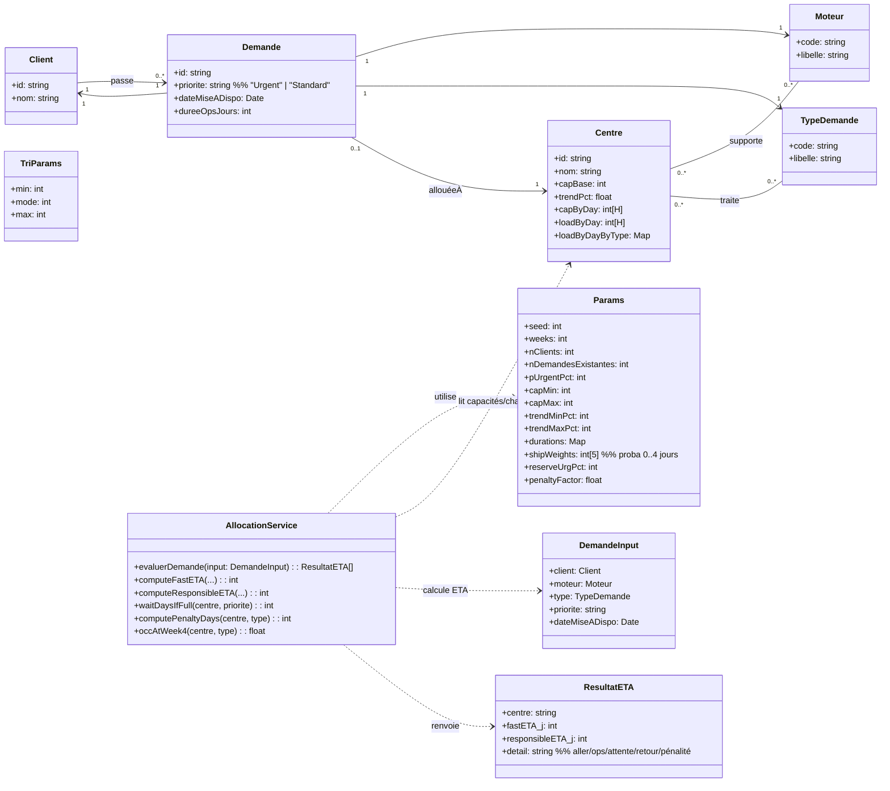
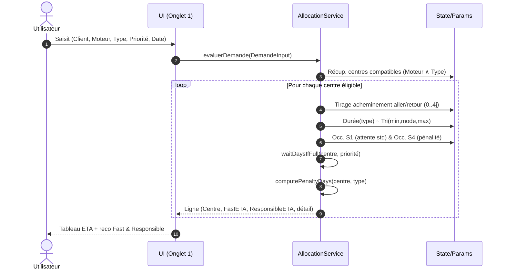

# Introduction

**📌 Objectifs d'un prototype de calcul HTML :**

- 💡 Transformer une idée en prototype concret
- 🗂️ Identifier les nouveau besoins métiers

**🛠 Usages concrets :**

- 🎨 Brainstorming / Co-construction
- ✍️ Spécifications / Critères d'acceptance
- 👥 Tests utilisateurs (UI/UX)
- 🖼️ Démos réalistes (UI/UX)

**💡 Démarche IA**

1. 🚲 Minimalisme → privilégier peu de logique métier, données statiques  
2. 🧩 Simplification → prototyper petit avec hypothèses légères  
3. 🎤 Clarification → demander à GPT de poser des questions  
4. 💡 Amélioration → demander à GPT des pistes d’optimisation  
5. 📦 Exhaustivité → regrouper un max de demandes dans un message avant régénération  
6. 📐 Vérification → générer un diagramme UML pour documenter  
7. 📝 Itération → amender le prompt jusqu’à satisfaction  
8. 📌 Transmission → demander à GPT de refournir le prompt final

**🤖 Lien à la conversation IA**
```
https://chatgpt.com/share/68a33867-818c-8006-ac8c-efbd47c3d3ec
```

# Prompt


# 1) Contexte 🌍
**❓ Cette section répond à :**
- À quoi sert MAESTRO et pour qui ?
- Quelles règles métier guident la recommandation de centre ?
- Quelles simplifications ont été prises pour le prototype ?
- Quelles stratégies de recommandation sont comparées ?

## Objectif
MAESTRO est un outil de **gestion et d’allocation des demandes de maintenance moteur**. Le prototype vise à **recommander le centre** le plus adapté pour une demande donnée et à **visualiser la charge/capacité** des centres sur 3 mois, avec deux stratégies :
- **FastETA** : minimise le délai total théorique (acheminement + ops + retour + attente basique).
- **ResponsibleETA** : ajoute une **pénalité de saturation** à 4 semaines pour éviter les centres fréquemment pleins (approche “responsable”).

## Règles métier (pilotage de la reco)
- Compatibilité **Centre × (Moteur, Type)** requise.
- **Urgent** prioritaire (pas d’attente additionnelle si saturation immédiate ; Standard peut attendre la 1ʳᵉ semaine si >100%).
- Pénalité ResponsibleETA basée sur le **taux d’occupation prévu** à 4 semaines pour le **type** (indépendant du moteur).
- **Bris d’égalité** : léger bruit (jitter ±0,5 j), puis **fiabilité** du centre.

## Simplifications retenues (pour le proto)
- **Acheminement** : tirage aléatoire discret (0–4 jours) à l’aller **et** au retour, durée fixe d'acheminement le centre et le client (pas de distance géo).
- **Durées d’opérations** : dépendent **du type** uniquement (pas de variation par moteur/centre).
- **Aucun aléa d’exécution** (maintenance déterministe hors randomisation initiale).
- **Arrivées des demandes** : linéaires (densité croissante à l’approche de la date d’opération).

---

# 2) Données 📊
**❓ Cette section répond à :**
- Quels objets et attributs composent le modèle de données ?
- Quelles listes de référence (moteurs, types, centres) sont utilisées ?
- Comment sont générées les capacités, charges et demandes existantes ?
- Quels paramètres de randomisation contrôlent le jeu de données ?

## Modèle (objets principaux)
- **Centre** `{id, name, engines:Set, types:Set, capBase, trend, capByDay[], loadByDay[], loadByDayByType[type][]}`
- **Demande** `{id, client, centreName, engine, type, priority, startDate, duration}`
- **Paramètres** `seed, weeks, clients, existing, pUrgent, capMin..capMax, trendMin..trendMax, durations[type]=[min,mode,max], shipW[0..4], reserveUrgPct, penaltyFactor`






## Référentiels
- **Moteurs (5)** : `LEAP-1A, LEAP-1B, CFM56-5B, CFM56-7B, SaM146`
- **Types (4)** : `Overhaul, RepairOnly, QuickInspection, TestOnly`
- **Centres (20 villes)** : Paris, Lyon, Toulouse, Bordeaux, Nantes, Lille, Marseille, Nice, Strasbourg, Rennes, Grenoble, Montpellier, Clermont-F., Rouen, Tours, Dijon, Nancy, Orléans, Metz, Reims
  - Chaque centre supporte **2–3 moteurs** et **2–3 types** (tirage uniforme sans doublon).

## Paramètres & distributions (éditables dans “Master Data”)
- **Seed** `42` ; **Horizon** `12 semaines` ; **Clients** `30` ; **Demandes existantes** `250` ; **%Urgent** `25%`.
- **Capacité de base (slots/jour)** : entier **U[4,10]**.
- **Facteur jour** : Lun–Jeu ~U[0.9,1.1] ; Ven ~U[0.8,1.0] ; Sam ~U[0.6,0.8] ; Dim ~U[0.4,0.6].
- **Tendance** (linéaire sur 12 sem.) : **U[-10%, +10%]**.
- **Durées (jours, triangulaire [min, mode, max])**  
  | Type             | Tri[min, mode, max] |
  |------------------|----------------------|
  | TestOnly         | [2, 3, 4]            |
  | QuickInspection  | [3, 4, 6]            |
  | RepairOnly       | [12, 18, 28]         |
  | Overhaul         | [35, 45, 65]         |
- **Acheminement (jours)** : tirage {0,1,2,3,4} avec poids `{25,35,20,15,5}%`. Retour = aller.
- **Urgent réservé** (concept) : `reserveUrgPct = 25%` (utilisé via la règle “Urgent = pas d’attente basique”).
- **Facteur de pénalité** : `penaltyFactor = 1.0` (échelle de la pénalité ResponsibleETA).

## Génération & calculs de charge
- **Capacité/jour** = `capBase × facteur_jour × drift(tendance)`.
- **Demandes existantes** : 250, avec **date de début** tirée dans l’horizon, **priorité** selon `%Urgent`.
- **Plottage** de la charge : pour chaque demande, **+1 slot/jour** pendant `durée`.
- **Occupation_jour** = `loadByDay / capByDay`, bornée à 150%.
- **Heatmap (hebdo)** : **max**(Occupation_jour) de la semaine.
- **Approx. moteur** pour heatmap (ligne `type × moteur`) : la charge de `type` est répartie **à parts égales** entre moteurs supportés (hypothèse d’affichage).

---

# 3) Interface 🧩
**❓ Cette section répond à :**
- Quels onglets et actions l’interface propose-t-elle ?
- Comment saisir une demande et consulter la recommandation ?
- Comment éditer la donnée et rejouer le calcul ?
- Quelles vues d’analyse (heatmap, listes filtrées) sont disponibles ?

## Structure Fiori-like (full width, responsive)
- **Topbar** : branding + **4 onglets**.
- **Cartes** (cards) avec entêtes, barres d’outils et **tables** lisibles.
- **Composants** : sélecteurs, boutons (primaire/secondaire/ghost), grilles.

## Onglet 1 — *Saisie & Reco*
- Formulaire : **Client**, **Moteur**, **Type**, **Priorité**, **Date de mise à disposition**.
- Bouton **Évaluer** → calcule et affiche toutes les options **Centre** avec **FastETA**, **ResponsibleETA** et **détail** (aller, ops, attente, retour, pénalité).
- Mise en avant de la **reco Fast** et **reco Responsible** (surbrillance).
- Bouton **Ajouter cette demande** → inscrit la demande dans la **charge** (impacte heatmap & futures ETAs).

## Onglet 2 — *Master Data & Randomization*
- Panneaux pour éditer : **Seed**, **Horizon**, **Volumes**, **Capacité min/max**, **Tendance min/max**, **Durées triangulaires**, **Poids d’acheminement**, **%Urgent**, **Facteur de pénalité**.
- Boutons : **Regénérer la donnée**, **Export JSON**, **Import JSON**.
- Tableau **Compatibilités** : Centre → Moteurs/Types/Cap. base.

## Onglet 3 — *Centres • Heatmap*
- Sélecteur **Centre**.
- **Heatmap 12 semaines** : lignes = **(Type × Moteur)** compatibles, colonnes = semaines, cellule = **max d’occupation** de la semaine.
- Infobulle survol : détail de la semaine / %.

## Onglet 4 — *Demandes • Liste*
- Filtres : **Centre**, **Moteur**, **Type**, **Priorité**, **Période (date de début)**.
- Tableau trié par date : `#`, `Client`, `Centre`, `Moteur`, `Type`, `Priorité`, `Début`, `Durée`.

---

# 4) Technique 🧠
**❓ Cette section répond à :**
- Quelles sont les formules d’ETA et les algorithmes de pénalité/attente ?
- Comment la randomisation est-elle implémentée ?
- De quoi est composé le stack technique et comment est gérée la performance ?
- Quelles limites/approximations connues ?

## Stack & patterns
- **HTML/CSS/JS vanilla** (standalone, **sans dépendances externes**) ; style **Fiori-like**.
- **RNG déterministe** : `mulberry32(seed)`.
- **Distributions** :
  - **Triangulaire** pour les durées (par type).
  - **Catégorielle pondérée** pour l’acheminement (0–4 jours).
- **État** en mémoire (`Params`, `State`) ; **export/import JSON**.
- **Performance** : horizon 12×7 jours ; tableaux effilés ; pas de canvas/DOM lourd.

## Formules
- **Durée moyenne par type** (pour pénalité) ≈ `(min + mode + max) / 3`.
- **Attente basique (semaine 1)** :
  - `waitDays(Standard) = ceil(max(0, Occ_semaine1 - 1) × 7)`.
  - `waitDays(Urgent) = 0`.
- **Pénalité Responsible (à 4 semaines, par type)** :
  - `Occ₄w = max_jour(semaine 4, loadType / cap)`
  - `excess = max(0, Occ₄w - 1)`.
  - `penaltyDays = penaltyFactor × excess × avgDuration(type)`.
- **ETA** :
  - `FastETA = shipOut + duration(type) + waitDays + shipBack`.
  - `ResponsibleETA = FastETA + penaltyDays`.
  - **Jitter** (anti-égalité) : ±0–0,5 j gaussien tronqué (arrondi final).
- **Compatibilité** : filtre **Centre × (Moteur, Type)**.
- **Placement de charge** (existing & ajout) : +1 **slot/jour** sur `duration` jours, à partir de `startDate`.

## Limites / approximations (connues)
- **Durées par type** uniquement (pas de granularité moteur/centre).
- **Approx. moteur heatmap** : partage égal de la charge du type entre moteurs supportés.
- **Urgent** : pas de file d’attente fine ni capacité réservée “dure” (règle simple = pas d’attente basique).
- **Acheminement** : pas de géoloc ; tirage discret.
- **Saisies** : pas de validation complexe (focus sur l’exploration).

## Extensions possibles (2–3 pistes)
- Introduire **durées par (Type × Moteur)** et **facteur centre**.
- Réserver **capacité dure** aux urgents par centre (ex. 20–30%).
- Ajouter **Top-3** centres avec **score multi-critères** (ETA, saturation, distance proxy).
