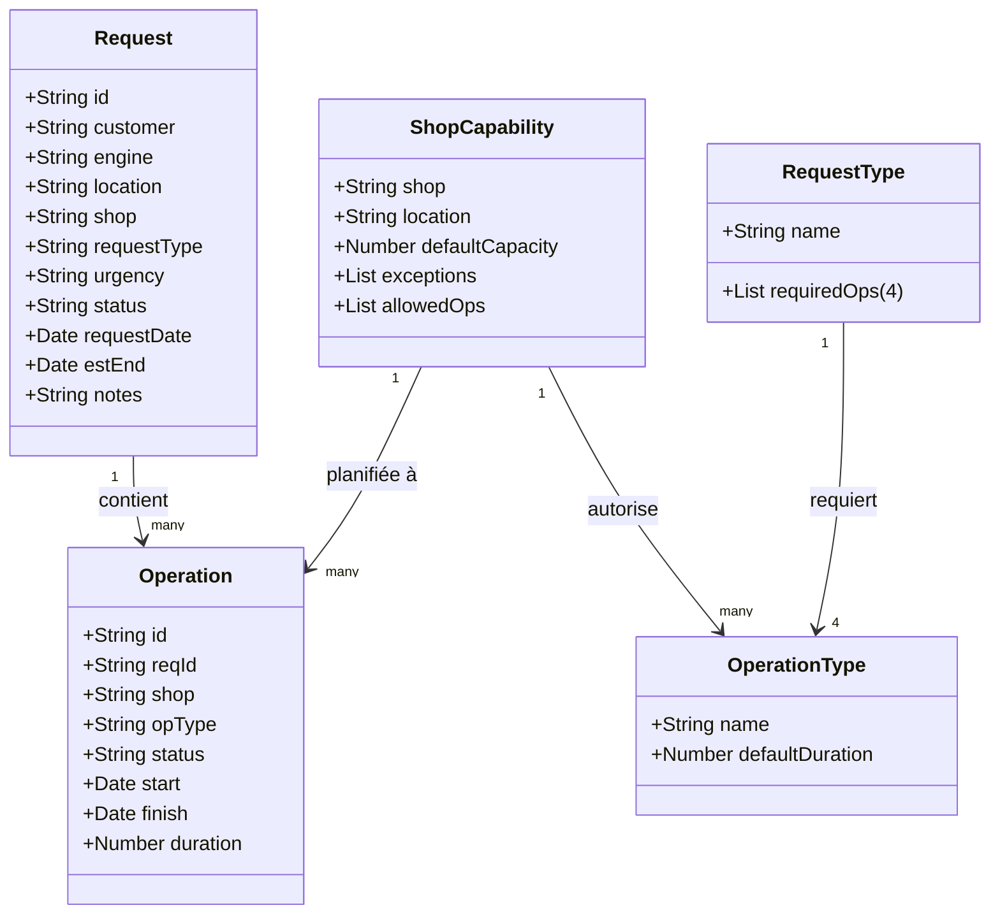

À copier dans GPT en lui demandant de `créer un prototype HTML standalone avec le contexte suivant`

---

# 1️⃣ Identité  

**Nom de l’application** : **MAESTRO**  
**Style visuel** : interface claire et moderne, inspirée de SAP IBP :  
- Organisation en **cartes et onglets**  
- En-têtes toujours visibles  
- **Couleurs codées** pour représenter les capacités (vert, jaune, rouge)  
- Boutons arrondis pour un rendu plus agréable  

**Objectif** :  
MAESTRO est une application locale, qui fonctionne entièrement dans un fichier HTML sans connexion Internet.  
Elle permet de :  
- **Créer et modifier** des demandes de maintenance moteur  
- **Suivre** les opérations associées  
- **Vérifier** les capacités des ateliers (shops)  
- **Visualiser** des indicateurs clés de performance (KPI)  

---

# 2️⃣ Modèle de données  

## Objets principaux  

### Demande (Request)  
C’est la fiche de départ : un client demande la maintenance d’un moteur.  
- **Contenu** : numéro unique, client, type de moteur, localisation, atelier choisi, type de demande, niveau d’urgence, statut, date de création, date de fin estimée, notes éventuelles  
- **Règles** : certains champs sont obligatoires (client, moteur, atelier, etc.). La date de fin est calculée automatiquement.  
- **Particularité** : chaque type de demande nécessite exactement **4 opérations** obligatoires.  

### Opération (Operation)  
Une demande est toujours composée de plusieurs opérations.  
- **Contenu** : numéro unique, lien avec une demande, atelier concerné, type d’opération, statut, date de début, durée prévue (1 à 5 semaines), date de fin  
- **Règles** : certains champs obligatoires. La date de fin se calcule seule.  
- **Particularité** : une opération doit être autorisée dans l’atelier choisi.  

### Listes maîtres (référentiels)  
Elles contiennent toutes les valeurs disponibles dans les menus déroulants :  
- Urgences, statuts, ateliers, localisations, types d’opérations, modèles moteurs, clients, types de demandes  

### Mappings & règles  
- Chaque type de demande doit correspondre à **4 opérations distinctes**  
- Chaque type d’opération a une **durée par défaut** (1 à 5 semaines)  
- Chaque atelier (shop) a une **capacité par défaut**, une localisation et peut avoir des exceptions  

## Relations entre données  
- Une demande → plusieurs opérations  
- Un atelier → plusieurs types d’opérations autorisés  
- Un type de demande → exactement 4 opérations  

## Données d’exemple  
À l’ouverture, l’application se remplit avec des données fictives :  
- 4 urgences, 4 statuts  
- 10 ateliers, 5 localisations  
- 12 types d’opérations  
- 5 modèles de moteur, 5 clients  
- 3 types de demandes (chacun avec 4 opérations)  
- 10 demandes et 30 opérations générées au hasard  

## Synthèse UML

---

# 3️⃣ Navigation et écrans  

## Les onglets principaux  

### Nouvelle demande  
- Formulaire simple pour saisir une demande (champs obligatoires en jaune)  
- Panneau d’aide :  
  - montre automatiquement les 4 opérations requises par type de demande  
  - permet de vérifier la capacité d’un atelier à une date donnée  
- **Actions** : créer une demande, recalculer la date de fin  

### Éditer opérations  
- Formulaire pour créer ou modifier une opération liée à une demande  
- Panneau d’aide : indique quelles opérations sont autorisées dans l’atelier choisi  
- **Actions** : sauvegarder ou supprimer l’opération  

### Demandes  
- Tableau de toutes les demandes  
- Chaque numéro de demande est cliquable → ouvre les opérations liées  

### Opérations  
- Tableau de toutes les opérations  
- Numéro d’opération cliquable → ouvre l’édition de cette opération  
- Numéro de demande cliquable → ouvre la fiche demande correspondante  

### Listes maîtres  
- Tableaux éditables pour ajouter/modifier les valeurs de référence (urgences, statuts, ateliers, etc.)  
- Mapping obligatoire : chaque type de demande doit être lié à 4 opérations distinctes  
- Table de durée par type d’opération  
- **Actions** : appliquer les changements, voir les données au format JSON (export/copie possible)  

### Tableau de bord (KPI)  
- % de demandes urgentes livrées dans les temps  
- Carte de chaleur (heatmap) des capacités hebdomadaires (par localisation et atelier, sur 8 semaines)  

## Navigation  
- Onglets visibles en permanence en haut de l’écran  
- Clic sur un ID → ouvre automatiquement l’écran concerné, avec un filtre déjà appliqué  

---

# 4️⃣ Techniques  

## Fonctionnalités intégrées  
- Tout tient dans **un seul fichier HTML** (aucune installation, aucun serveur)  
- Données d’exemple créées automatiquement au démarrage  
- Menus déroulants dynamiques (par ex. : les opérations proposées dépendent de l’atelier choisi)  
- Calculs automatiques : dates de fin, capacité disponible, KPI  
- Tableaux filtrables et recherche instantanée  
- Import / export de toutes les données en JSON  
- Visionneuse JSON pratique : repliable, copiable, téléchargeable  
- Tableaux avec en-têtes fixes et survol des lignes  
- Tableau de bord mis à jour en temps réel  
- Affichage adapté mobile (les sections se mettent en pile)  

## Limitations techniques  
- Pas de sauvegarde automatique (il faut exporter/importer les données pour garder l’historique)  
- Pas de connexion serveur (tout se fait dans ton navigateur)  
- Les capacités sont toujours calculées par semaine entière (selon la norme ISO)  
- Si les règles de mapping ou de durée ne sont pas respectées, un avertissement s’affiche  
